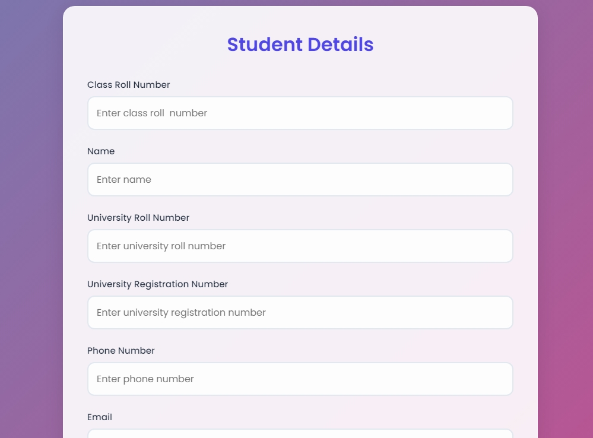

# Student Management System 🎓

## Overview
A modern, responsive web application for managing student records with a beautiful user interface. The system allows administrators to add, view, and delete student information with a seamless user experience and stunning visual design.

![Project Preview]


## Features 🌟

### Core Functionality
- **Student Record Management**
  - Add new student records
  - View existing student details
  - Delete student records via confirmation modal
  - Real-time data updates

### Data Fields
- Class Roll Number
- Student Name
- University Roll Number
- University Registration Number
- Phone Number
- Email Address
- Father's Name
- Father's Phone Number
- Fees Status (Paid/Unpaid)
- Attendance Percentage
- Backlog Count

### UI/UX Features 🎨
- **Modern Design**
  - Animated gradient background
  - Glass-morphism effects
  - Smooth transitions and animations
  - Responsive layout for all devices

- **Interactive Elements**
  - Hover effects on cards and buttons
  - Beautiful form inputs with focus states
  - Animated deletion modal
  - Status indicators with color coding

## Technical Stack 💻

### Frontend
- HTML5
- CSS3 with modern features:
  - CSS Grid
  - Flexbox
  - CSS Variables
  - Animations
  - Transitions
- JavaScript (ES6+)

### Backend Integration
- Supabase for database management
- Real-time data synchronization

### External Dependencies
- Poppins Font (Google Fonts)
- Supabase JavaScript Client

## Setup Instructions 🚀

1. **Clone the Repository**
   ```bash
   git clone [repository-url]
   cd student-management-system
   ```

2. **Configure Supabase**
   - Create a Supabase account at https://supabase.com
   - Create a new project
   - Replace the Supabase credentials in the code:
     ```javascript
     const SUPABASE_URL = 'your-supabase-url';
     const SUPABASE_API_KEY = 'your-supabase-api-key';
     ```

3. **Database Schema**
   Create a table named 'students' with the following columns:
   ```sql
   CREATE TABLE students (
     id SERIAL PRIMARY KEY,
     class_roll TEXT,
     name TEXT,
     u_roll_no TEXT,
     u_reg_no TEXT,
     phone TEXT,
     email TEXT,
     father_name TEXT,
     father_number TEXT,
     fees TEXT,
     attendance TEXT,
     backlog INTEGER
   );
   ```

4. **Deploy**
   - Upload the files to your web server, or
   - Use a local development server

## Usage Guide 📖

### Adding a Student
1. Fill in all required fields in the form
2. Click the "Add" button
3. Confirm successful addition via alert

### Viewing Records
1. Click the "Fetch" button to load all student records
2. Records are displayed as cards with:
   - Student information
   - Contact details
   - Academic status

### Deleting a Record
1. Click the "Delete" button
2. Enter the student's university roll number in the modal
3. Confirm deletion
4. Record will be removed from database

## Styling Customization 🎨

### Color Scheme
Modify the root variables in CSS:
```css
:root {
    --primary-color: #ff758c;
    --primary-dark: #4f46e5;
    --secondary-color: #f8fafc;
    --text-color: #1e293b;
    --border-radius: 12px;
}
```

### Background Animation
Adjust the gradient animation speed:
```css
body {
    animation: gradient 15s ease infinite;
}
```

## Browser Support 🌐
- Chrome (latest)
- Firefox (latest)
- Safari (latest)
- Edge (latest)
- Opera (latest)

## Performance Optimization Tips 🚀
1. Minimize network requests by bundling CSS/JS
2. Use image optimization for better load times
3. Implement lazy loading for student records
4. Cache Supabase responses when appropriate

## Contributing 🤝
1. Fork the repository
2. Create a feature branch
3. Commit your changes
4. Push to the branch
5. Create a Pull Request

## License 📝
This project is licensed under the MIT License - see the LICENSE.md file for details.

## Support 🆘
For support, please email [muskanrangel@gmail.com] or open an issue in the repository.

## Credits 👏
- Design inspiration from modern web applications
- Icons and fonts from Google Fonts
- Backend powered by Supabase
